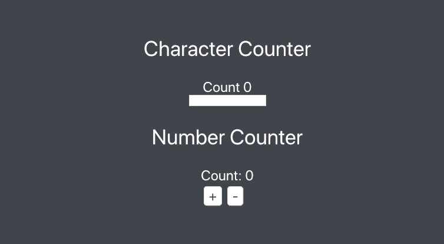

# React Recoil Counter Example

Recoil state management with react test using counter example

[Demo](https://react-recoil-counter-example.vercel.app/)



## Getting Started

In the project directory, you can run:

```bash
# Install dependencies
npm install

# Start server on http://localhost:3000
npm start
```

## Built With

- [Recoil (State Management)](https://recoiljs.org/)
- [React JS](https://reactjs.org/)
